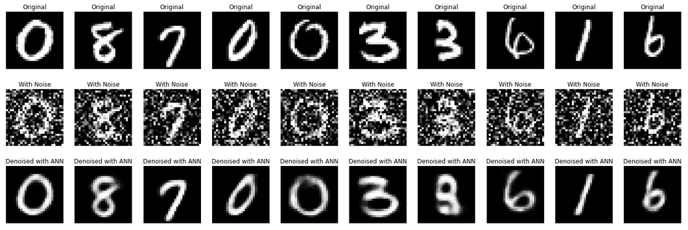

# Image-Denoising-using-AutoEncoders

We will train autoencoder that will denoise handwritten digits in the MNIST dataset.
As an input, we will feed images corrupted by some well-visible noise. At the output, we will get the denoised image.
